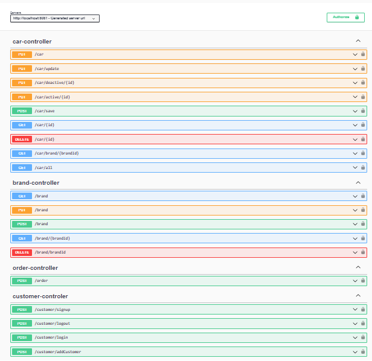

# **rent-a-car**
Araç Kiralama Uygulaması

# Proje Detayı
&bull; Kullanıcı Tarafı
     &#x25A0; JWT entegrasyonu yapılmıştır.
     &#x25A0; Kullanıcı sisteme üye olabilir.
     &#x25A0; Kullanıcı login olaiblir.
     &#x25A0; Kullanıcı logout olabilir.
&bull; Kullanıcı Login Olduktan Sonra
     &#x25A0; Kullanıcı markaya göre araç seçip sepete ekleyebilir.
     &#x25A0; Kullanıcı admin ise araç ekleyebilir, var olan aracı güncelleyebilir veya silebilir.
&bull; Bonus
    &#x25A0; Uygulama ayağa kalkarken otomatik DB oluşturulmaktadır. Her tabloya en az 2 kayıt atılmıştır.

# Kullanılan Teknolojiler  
&#x25cb; Java 17+
&#x25cb; Maven 4.0+
&#x25cb; Spring-Boot 3.1.5+
&#x25cb; Swagger Doc
&#x25cb; Slf4j Logging
&#x25cb; Mockito -> Unit Test

# Swagger Documentation
&bull; http://localhost:8081/swagger-ui

 
